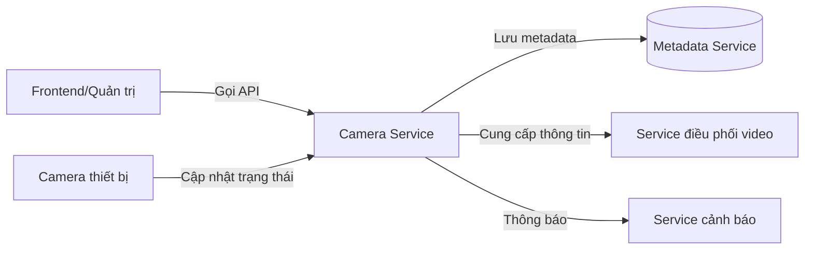

# Service Boundary của nhóm

## 1. Thông tin nhóm

- Tên nhóm: 1B
- Lớp: CNTT17-10
- Thành viên: Nguyễn Hoàng Thái, Lê Minh Tân, Nguyễn Văn Thắng
- Service nhóm phụ trách: Camera Service
- Sản phẩm tổng thể của lớp: Hệ thống giám sát an ninh thông minh với nhiều service hợp nhất

## 2. Actor

Ai tương tác với hệ thống/service?

- Người dùng quản trị (Admin): cấu hình camera, quản lý trạng thái, xem thông tin camera.
- Thiết bị camera: đăng ký, gửi trạng thái và nhận yêu cầu cấu hình từ service.
- Service khác trong hệ thống: nhận dữ liệu trạng thái camera hoặc cung cấp thông tin người dùng.

## 3. System Boundary

Nhóm em xây phần nào?

Phần nhóm kiểm soát:

- Quản lý thông tin camera, bao gồm đăng ký, cập nhật, xóa camera.
- Theo dõi trạng thái kết nối, IP, vị trí và trạng thái hoạt động của camera.
- Cung cấp API cho phép lấy danh sách camera, chi tiết camera và kiểm tra trạng thái hệ thống.

Phần nhóm chỉ tích hợp:

- Gửi thông tin camera đến service điều phối hoặc service lưu trữ video.
- Nhận yêu cầu lấy thông tin camera từ frontend hoặc các service khác.
- Không lưu trữ trực tiếp video, không xử lý phân tích hình ảnh, không quản lý tài khoản người dùng.

## 4. Service Boundary

Service của nhóm có trách nhiệm gì?

- Quản lý đăng ký và cấu hình camera.
- Cung cấp endpoint để kiểm tra tình trạng hoạt động và kết nối của camera.
- Trả về danh sách camera và chi tiết camera cho frontend hoặc service khác.
- Cập nhật trạng thái camera khi thiết bị gửi heartbeat hoặc thay đổi kết nối.
- Giới hạn quyền truy cập với các endpoint căn cứ trên role (Admin, system).  

Service KHÔNG làm gì?

- Không lưu trữ nội dung video.
- Không xử lý/định dạng luồng video.
- Không phân tích hình ảnh (nhận diện, phát hiện chuyển động).
- Không thay thế service xác thực người dùng.
- Không điều khiển trực tiếp camera (ví dụ PTZ) nếu không có API điều khiển riêng.

## 5. Input / Output

### Input

- Yêu cầu đăng ký camera mới với thông tin: ID thiết bị, địa chỉ IP, vị trí, model.
- Yêu cầu cập nhật cấu hình camera từ frontend hoặc service khác.
- Yêu cầu kiểm tra trạng thái camera.
- Sự kiện báo trạng thái camera online/offline từ thiết bị.
- Yêu cầu lấy danh sách camera và thông tin chi tiết camera.

### Output

- Trả về kết quả đăng ký/cập nhật/xóa camera.
- Trả về danh sách camera hiện có.
- Trả về trạng thái hoạt động của từng camera.
- Trả về thông tin phản hồi khi kiểm tra sức khỏe service.
- Gửi thông tin camera cho service lưu trữ và điều phối nếu cần.

## 6. API dự kiến

| Method | Endpoint | Mục đích |
|---|---|---|
| GET | /health | Kiểm tra trạng thái hoạt động của Camera Service |
| GET | /cameras | Lấy danh sách tất cả camera |
| GET | /cameras/{id} | Lấy chi tiết một camera theo ID |
| POST | /cameras | Đăng ký camera mới |
| PUT | /cameras/{id} | Cập nhật cấu hình camera |
| DELETE | /cameras/{id} | Xóa camera khỏi hệ thống |
| POST | /cameras/{id}/status | Cập nhật trạng thái camera từ thiết bị |

## 7. Phụ thuộc service khác

Service này gọi đến service nào?

- Service lưu trữ metadata: để ghi nhận thông tin camera và quan hệ với khu vực giám sát.
- Service điều phối luồng video: thông báo cho service này khi cần lấy thông tin camera hiện tại.
- Service thông báo/alert: gửi thông tin camera offline hoặc lỗi kết nối nếu cần.

Service nào gọi đến service này?

- Frontend/Ứng dụng quản trị: gọi API để hiển thị danh sách camera, chi tiết camera và thực hiện thao tác quản lý.
- Service điều phối và lưu trữ video: gọi để lấy thông tin camera và trạng thái hoạt động.
- Thiết bị camera: gọi endpoint cập nhật trạng thái hoặc thực hiện đăng ký ban đầu.

## 8. Sơ đồ minh họa

Có thể vẽ bằng Mermaid, draw.io, Ludichart hoặc ảnh chụp sơ đồ.

